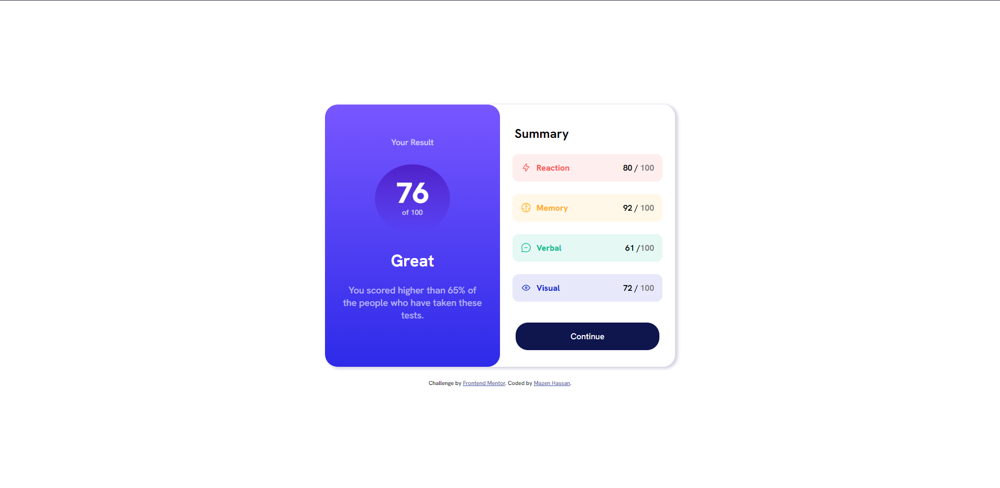

# Frontend Mentor - Results summary component solution

This is a solution to the [Results summary component challenge on Frontend Mentor](https://www.frontendmentor.io/challenges/results-summary-component-CE_K6s0maV). Frontend Mentor challenges help you improve your coding skills by building realistic projects. 

## Table of contents

- [Frontend Mentor - Results summary component solution](#frontend-mentor---results-summary-component-solution)
  - [Table of contents](#table-of-contents)
    - [The challenge](#the-challenge)
    - [Screenshot](#screenshot)
    - [Links](#links)
    - [Built with](#built-with)
    - [What I learned](#what-i-learned)
    - [Continued development](#continued-development)

### The challenge

Users should be able to:

- View the optimal layout for the interface depending on their device's screen size
- See hover and focus states for all interactive elements on the page
- **Bonus**: Use the local JSON data to dynamically populate the content

### Screenshot

### Links

- Solution URL: https://www.frontendmentor.io/challenges/results-summary-component-CE_K6s0maV/hub?share=true
- Live Site URL: https://mazz100.github.io/Result-Summary-Component/

### Built with

- Semantic HTML5 markup
- CSS custom properties
- Flexbox
- CSS Grid
- Mobile-first workflow
- [Styled Components](https://sass-lang.com/guide/) - For styles

### What I learned

I got confident with using CSS flexbox and grid layouts. In this project I used linear-gradient to achieve the color gradient for design

### Continued development

I want to learn more about gradients, more advanced CSS animations, and many new advanced css techniques.

